# Laporan Modul 2: Laravel Fundamentasl
**Mata Kuliah:** Workshop Web Lanjut   
**Nama:** Nayla Mutia Silvia Dina  
**NIM:** 2024573010106  
**Kelas:** TI-2B

---

## Abstrak 
Laporan ini membahas konsep dasar framework Laravel, termasuk pembuatan route, controller, dan Blade view, serta penerapan validasi input. Laporan ini bertujuan untuk memberikan pemahaman mengenai alur kerja Laravel dalam mengelola request dan response, serta memperkenalkan implementasi konsep arsitektur MVC melalui pembuatan aplikasi kalkulator sederhana.

---

## 1. Dasar Teori
1.1 MVC (Model, View, Controller)
MVC adalah pola arsitektur yang memisahkan aplikasi menjadi tiga komponen utama: 

1. Model : bagian yang mengatur data, misalnya mengambil data dari database, menyimpan data baru, atau mengubah data yang sudah ada.
2. View : merupakan bagian yang menampilkan informasi ke pengguna (antarmuka pengguna).
3. Controller : bagian yang menjadi penghubung antara Model dan View. Controller menerima permintaan dari pengguna, mengambil data dari Model, lalu mengirimkan data tersebut ke View untuk ditampilkan.

Dengan pembagian ini, kode menjadi lebih teratur, mudah diperbaiki, dan dikembangkan.

1.2 Routing di Laravel
Routing adalah mekanisme untuk menentukan bagaimana aplikasi merespons sebuah request. Di Laravel, routing didefinisikan pada file routes/web.php menggunakan metode seperti Route::get() atau Route::post().

1.3 Middleware
Middleware bertindak sebagai perantara antara request dan response. Fungsinya antara lain untuk autentikasi, logging, atau memodifikasi request sebelum diteruskan ke controller.

1.4 Request dan Response di Laravel
Laravel memproses request dengan mencocokkan URL ke route yang sesuai, menjalankan middleware, memanggil controller yang ditentukan, dan akhirnya mengirim response kembali ke browser berupa view atau data.

1.5 Peran Controller dan View
Controller menangani logika aplikasi, memproses input dari user, dan mengirimkan data ke view. View bertanggung jawab menampilkan data dalam format HTML yang mudah dibaca pengguna.

1.6 Fungsi Blade Templating Engine
Blade adalah template engine Laravel yang memungkinkan penggunaan sintaks sederhana seperti {{ $variable }}, serta mendukung layout, komponen, dan control structure seperti @if atau @foreach untuk membuat tampilan lebih dinamis.

---

## 2. Langkah-Langkah Praktikum

2.1 Praktikum 1 – Route, Controller, dan Blade View

- Menambahkan route pada routes/web.php
Untuk menambahkan Route, tambahkan kode : Route::get('/welcome', [WelcomeController::class, 'index']);

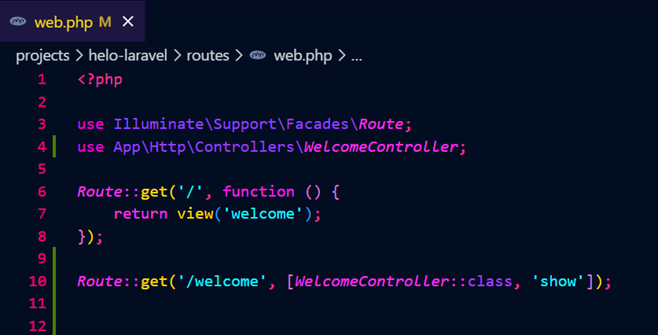

- Membuat controller WelcomeController
Buat file WelcomeController.php di folder app/Http/Controllers/ 

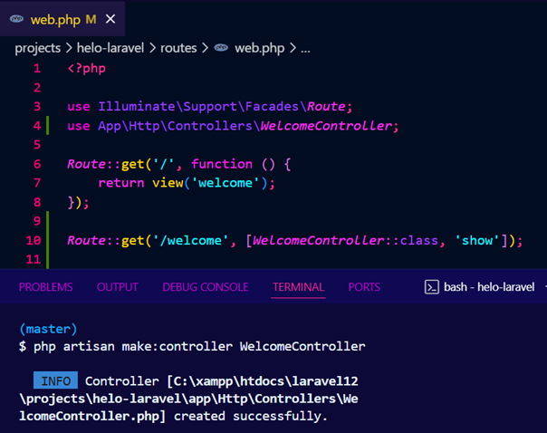

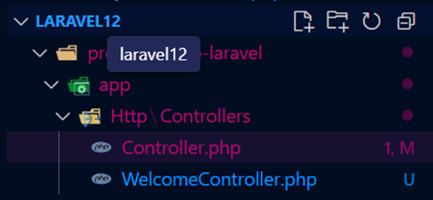

Kemudian isi:

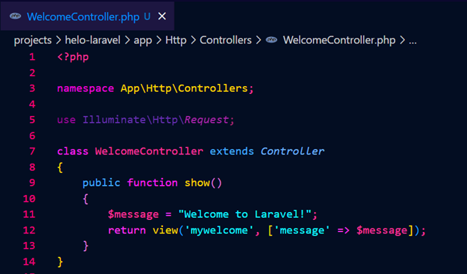

- Membuat view mywelcome.blade.php
Buka resources/views kemudian buat file dengan nama mywelcome.blade.php

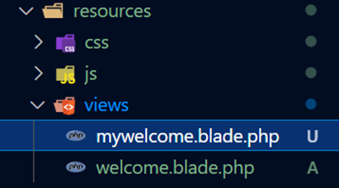

isi sederhana seperti:

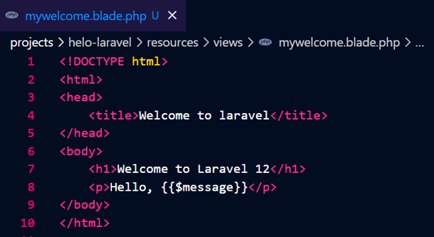

- Menjalankan aplikasi dan menunjukkan hasil di browser
Buka terminal dan jalankan perintah : php artisan serve

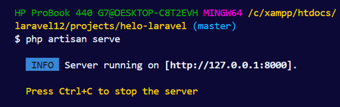

buka browser dan akses http://127.0.0.1:8000/welcome untuk melihat hasilnya

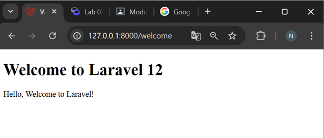

2.2 Praktikum 2 – Membuat Aplikasi Sederhana "Calculator"

- Menambahkan route untuk kalkulator
Tambahkan kode berikut di routes/web.php: 
Route::get('/calculator', [CalculatorController::class, 'index']);
Route::post('/calculator', [CalculatorController::class, 'calculate']);

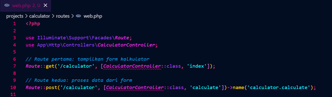

- Membuat controller CalculatorController
Buat file CalculatorController.php di folder app/Http/Controllers/

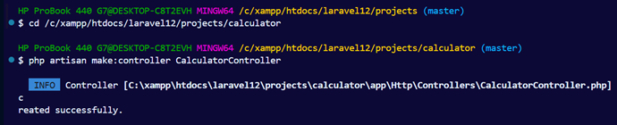

Kemudian isi file seperti berikut:

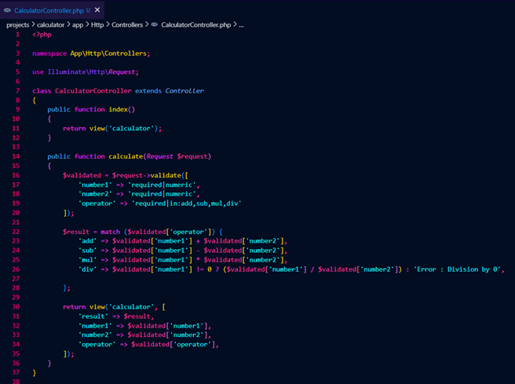

- Menambahkan view calculator.blade.php
Buat file resources/views/calculator.blade.php

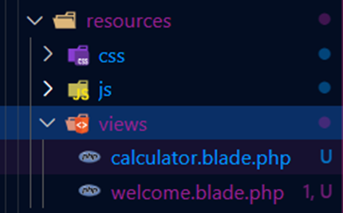

Kemudian isi file seperti berikut:

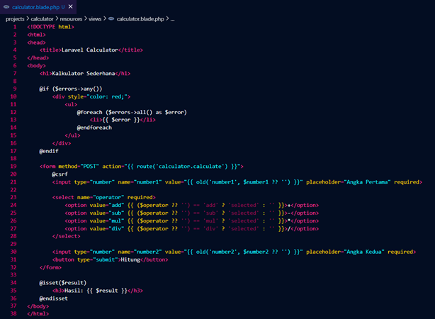

- Menjalankan aplikasi dan coba dengan beberapa input berbeda
Jalankan perintah php artisan serve

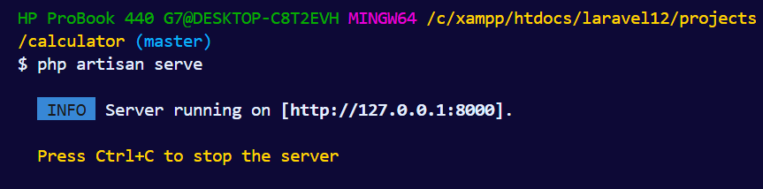

Buka http://127.0.0.1:8000/calculator

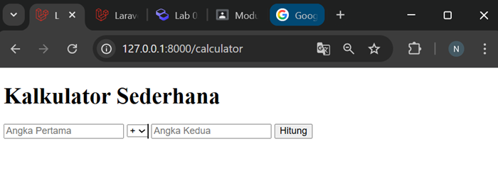

Masukkan angka, pilih operator, lalu klik tombol Hitung:
1. Operator Penjumlahan

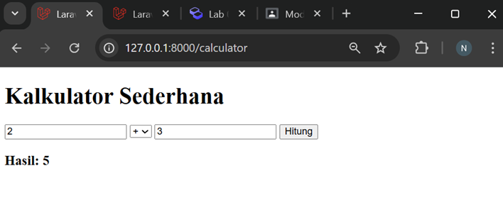

2. Operator Pengurangan

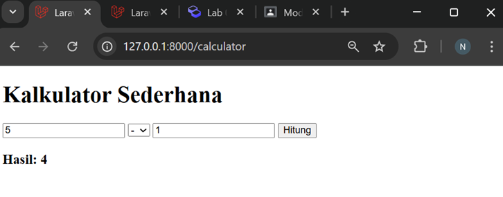

3. Operator Perkalian

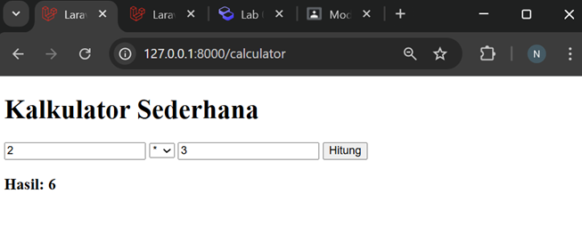

4. Operator Pembagian

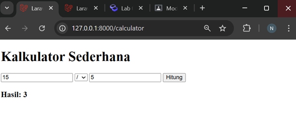

5. Pembagian dengan 0

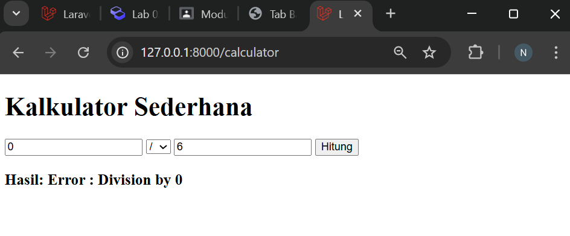

Jika pengguna melakukan pembagian dengan angka nol, aplikasi akan menampilkan pesan “Error: Division by 0” pada halaman, sehingga tidak terjadi internal server error.

6. Menginput String

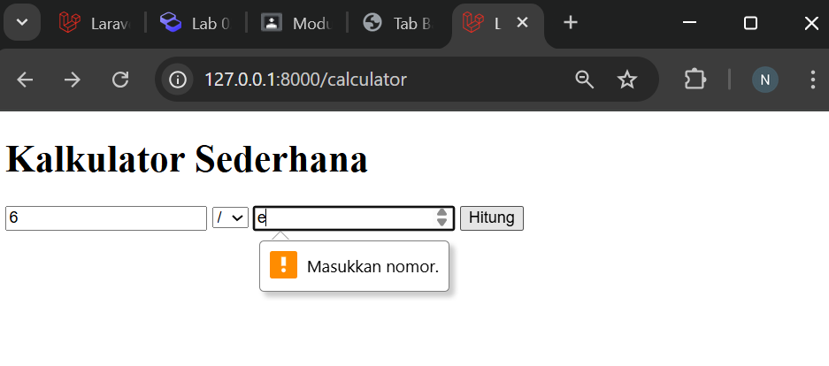

Jika pengguna mencoba memasukkan karakter non-angka, browser akan menampilkan peringatan “Masukkan nomor.” dan input tidak diproses.

---

## 3. Hasil dan Pembahasan

Hasil dari praktikum menunjukkan bahwa aplikasi berjalan sesuai harapan. Halaman welcome dapat ditampilkan melalui route yang sudah dibuat. Pada aplikasi kalkulator, setiap input angka dan operator dapat diproses oleh controller dan ditampilkan pada view.

Jika terjadi kesalahan input, seperti memasukkan nilai non-numerik (misalnya huruf), browser akan menampilkan peringatan “Masukkan nomor.” sehingga input tidak bisa dikirim. Sedangkan jika dilakukan pembagian dengan angka nol, aplikasi tidak mengalami error, tetapi menampilkan pesan “Error : Division by 0” pada halaman hasil. Hal ini membantu pengguna mengetahui adanya kesalahan tanpa membuat aplikasi berhenti.

Validasi input di Laravel bekerja dengan memeriksa data yang dikirim pengguna sebelum dijalankan logika perhitungannya. Jika data tidak sesuai aturan (misalnya bukan angka atau operator yang tidak valid), Laravel otomatis mengembalikan pesan error dan tidak melanjutkan proses perhitungan.

Peran komponen MVC dalam program:

Route bertugas mengarahkan request ke controller yang sesuai. Pada praktikum ini, kedua route memastikan halaman kalkulator dapat diakses dan data yang dikirim dari form diproses oleh CalculatorController.

Controller berperan dalam menangani logika aplikasi, memproses input, dan mengembalikan hasil ke view. Pada praktikum, kode tersebut memvalidasi input, menghitung hasil, dan mengirim data ke view.

View berperan dalam menampilkan form input dan hasil perhitungan kepada pengguna.Pada praktikum ini berguna untuk menampilkan hasil perhitungan atau pesan error secara rapi di halaman.

---

## 4. Kesimpulan

Berdasarkan praktikum yang dilakukan, dapat disimpulkan bahwa Laravel mempermudah pengembangan aplikasi web dengan pendekatan MVC. Pemisahan antara Route, Controller, dan View membuat kode lebih terstruktur, mudah dipahami, dan mudah dipelihara.

Penerapan pada aplikasi kalkulator sederhana menunjukkan bahwa setiap komponen memiliki peran penting: Route mengarahkan permintaan pengguna, Controller memproses logika perhitungan dan validasi, sedangkan View menampilkan hasil atau pesan error dengan jelas. Selain itu, mekanisme validasi input Laravel membantu mencegah kesalahan perhitungan seperti memasukkan data non-numerik atau pembagian dengan nol sehingga aplikasi tetap berjalan stabil.

---

## 5. Referensi

[1] "Modul 2 - Laravel Fundamentals" — https://hackmd.io/@mohdrzu/B1zwKEK5xe

[2] "Building MVC Applications in PHP Laravel: Part 2" — https://www.codemag.com/Article/2207041/Building-MVC-Applications-in-PHP-Laravel-Part-2

[3] "Cara menggunakan Laravel bagi pemula" — https://www.hostinger.com/id/tutorial/cara-menggunakan-laravel?utm_medium=ppc&utm_campaign=Generic-Tutorials-DSA

---