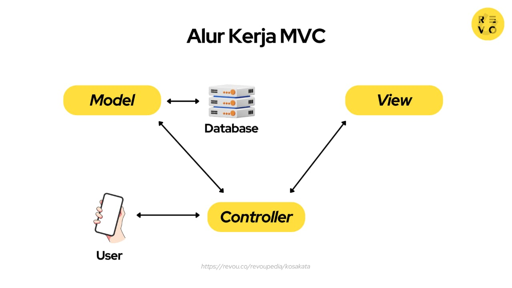

# Laporan Modul 1: Perkenalan Laravel
**Mata Kuliah:** Workshop Web Lanjut   
**Nama:** Nayla Mutia Silvia Dina  
**NIM:** 2024573010106  
**Kelas:** TI-2B

---

## Abstrak 
Laporan ini berisi pengenalan dasar tentang framework Laravel, meliputi teori, komponen utama, struktur folder, serta konsep MVC yang menjadi pondasi utamanya. Tujuan pembuatan laporan ini adalah agar mahasiswa memahami dasar penggunaan Laravel sebelum melangkah ke tahap implementasi yang lebih kompleks pada pembuatan aplikasi berbasis web.

---

## 1. Pendahuluan

Laravel adalah salah satu framework PHP open-source yang paling populer untuk membangun aplikasi web modern. Framework ini dirancang untuk memudahkan developer dalam membuat aplikasi yang rapi, terstruktur, aman, dan efisien. Laravel menyediakan banyak fitur bawaan seperti autentikasi, routing, session, dan caching, sehingga pengembangan aplikasi menjadi lebih cepat dibandingkan membangun dari nol.

Karakteristik Utama Laravel

- MVC (Model-View-Controller): memisahkan data (Model),    logika (Controller), dan tampilan (View).
- Opinionated: punya aturan baku yang memandu developer.
- Blade Template: mempermudah membuat tampilan dinamis.
- Eloquent ORM: akses database lebih mudah tanpa SQL rumit.
- Routing sederhana & fleksibel.
- Fitur bawaan lengkap: autentikasi, validasi, middleware, API, dsb.

Laravel cocok digunakan untuk membangun aplikasi berbasis web, seperti sistem informasi akademik, aplikasi e-commerce, portal berita, hingga aplikasi berskala besar dengan kebutuhan kompleks.

---

## 2. Komponen Utama Laravel (ringkas)

- Blade (Templating): Mesin template Laravel untuk membuat tampilan dinamis dengan sintaks sederhana.

- Eloquent (ORM): Fasilitas untuk mengelola database menggunakan model berorientasi objek, tanpa perlu menulis query SQL panjang.

- Routing: Mengatur URL agar terhubung ke controller atau aksi tertentu dengan cara yang simpel dan fleksibel.

- Controllers: Tempat menulis logika aplikasi yang menghubungkan antara data (model) dan tampilan (view).

- Migrations & Seeders: Migration digunakan untuk mengatur struktur database, sedangkan Seeder untuk mengisi data awal secara otomatis.

- Artisan CLI: Command Line Interface bawaan Laravel untuk mempercepat pekerjaan seperti membuat model, controller, migrasi, atau menjalankan server.

- Testing (PHPUnit): Fasilitas untuk menguji aplikasi agar bebas dari bug dan memastikan fitur berjalan sesuai harapan.

---

## 3. truktur Folder & File pada Project Laravel

- app/ → Berisi logika utama aplikasi, seperti model, controller, dan middleware.
- bootstrap/ → Menginisialisasi framework dan memuat konfigurasi awal.
- config/ → Berisi file konfigurasi aplikasi (database, mail, queue, dll).
- database/ → Menyimpan migration, seeder, dan factory untuk database.
- public/ → Folder yang diakses user lewat browser (berisi index.php, asset seperti CSS/JS).
- resources/ → Menyimpan view (Blade), file bahasa, dan asset mentah.
- routes/ → Menyimpan file routing (web.php, api.php, console.php).
- storage/ → Menyimpan file sementara (cache, log, session).
- tests/ → Menyimpan file untuk unit testing atau feature testing.
- vendor/ → Berisi library eksternal yang di-install lewat Composer.

---

## 4. Diagram MVC dan Cara kerjanya

1. User mengakses aplikasi lewat browser.
2. Request masuk ke Route.
3. Route meneruskan request ke Controller.
4. Controller memproses data dengan bantuan Model (akses database).
5. Hasil dari Model dikirim kembali ke View (Blade).
6. View menampilkan response ke user.

---

## 6. Kelebihan & Kekurangan (refleksi singkat)

Kelebihan
- Sintaks rapi & mudah dipahami.
- Fitur bawaan lengkap (auth, routing, ORM).
- Dokumentasi jelas & komunitas besar.
- Terstruktur dengan arsitektur MVC.

Tantangan Pemula
- Struktur folder kompleks.
- Banyak istilah baru (ORM, migration, middleware).
- Butuh pemahaman OOP & PHP modern.

---

## 7. Referensi

- Laravel Official Documentation — https://laravel.com/docs
- Modul Workshop Web Lanjut — https://hackmd.io/@mohdrzu/By0Wc1Dule
- GeeksforGeeks — Laravel Introduction — https://www.geeksforgeeks.org/laravel-introduction

---
